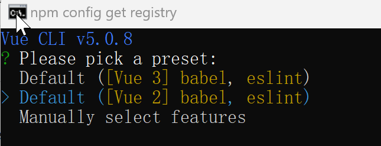
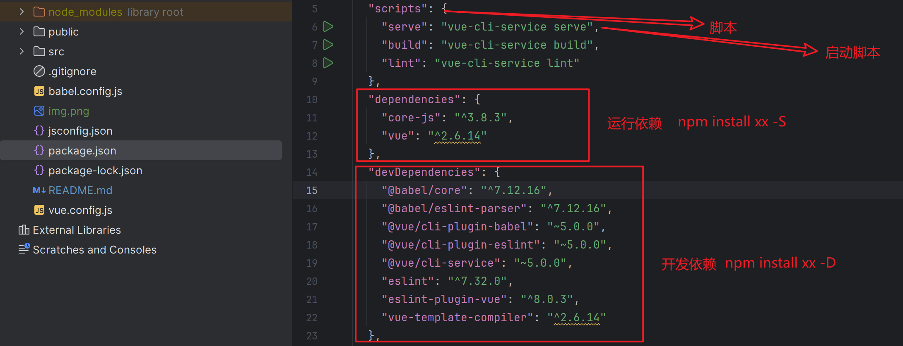

# VueCli
## 环境
+ Node.js: https://nodejs.org/zh-cn/download
+ nvm: https://link.juejin.cn/?target=https%3A%2F%2Fgithub.com%2Fcoreybutler%2Fnvm-windows%2Freleases
```bash
npm config set registry https://registry.npmmirror.com
```

## Vue2
根据 https://v2.cn.vuejs.org/ 文档
```
npm install -g @vue/cli

# 卸载
npm uninstall jquery
```

## 创建项目
```bash
vue create vue_cli_hou
```



### 目录结构
+ node_modules: 依赖库，可以随便删除
```bash
# 统一安装
npm install
```
+ public : 单页应用目录
+ src: 源码
  + App.vue：根组件
  + main.js: 单页应用的入口 js 文件，所有的 js , css 必须通过 main.js 才能生效

### 路由
vue2:使用 3 版本路由

vue3:使用 4 版本路由
```
npm install vue-router@3
```
```js
import VueRouter from "vue-router";
import Vue from "vue";
/* 插件 - 安装 */
Vue.use(VueRouter);
import Home from "@/components/Home.vue";

/* 配置路由的本质：就是为组件定义访问路径 */
const routes = [
    {
        path: "/home",
        component: Home,
    },
    {
        path: "/about",
        component: () => import("@/components/About.vue"),
    }
]

export default new VueRouter({
    routes
});
```
```js
import router from "@/router/index.js";

new Vue({
  render: h => h(App),
  router
}).$mount('#app')
```